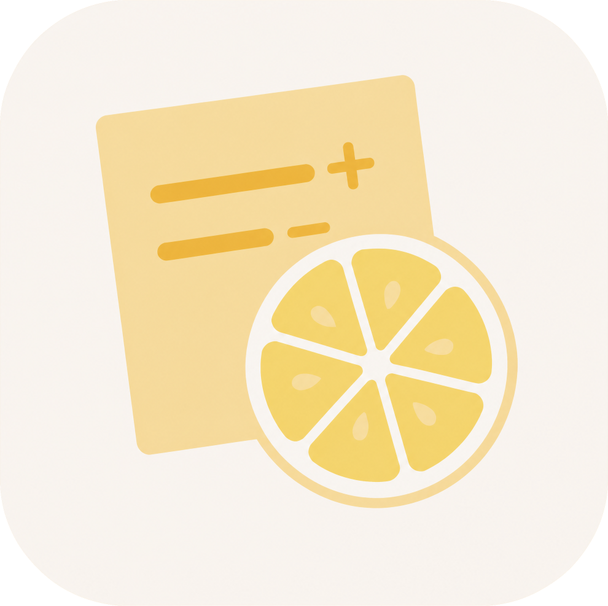

<div align="center">



# Sticky Scope

**一个常驻桌面、始终置顶的便签,实时告诉你任意文件夹里改了什么 —— 无需 Git。**

[](https://go.dev) [](https://wails.io) [](https://vuejs.org) [](#环境要求) []()

[English](README.md) · **简体中文**

</div>

Sticky Scope 会监控你指定的目录,实时显示自某个基线快照以来**新增、修改、删除**的每一个文件 —— 带行数统计和逐行 diff。它以一张小巧的便签形式钉在桌面上,让你随时掌握手头正在进行的改动,哪怕这个目录根本不是 Git 仓库。

可以把它理解为一个轻量、不依赖版本控制的「我改了什么?」浮层,适用于任意文件夹:草稿、配置目录、素材库、生成产物,或正在做实验的代码库。

## 为什么做这个工具

这本是个为我自己挠痒的小工具。用 AI 辅助编程时,我多次遇到 AI 工具的 diff 面板「罢工」—— 改动没被如实收录,于是我总担心它会在我没留意的地方动过文件。结果每次接手新需求前,我都要反反复复手动和上一版逐处比对,既累人,又始终不踏实。

于是就有了 Sticky Scope:把「手动比对」这件苦差事接管过去,变成桌面上一个常驻、实时显示改动的小窗口。

而且它不只用于代码。Git 能回答「自上次提交以来改了什么」,但很多工作发生在仓库之外。Sticky Scope 为**任意**目录提供同样的 _diff_ 反馈,而且呈现在屏幕角落的一个窗口里,不必反复回到终端里敲命令。

它就是个小而专注的工具。如果你也属于「非得实时看到 diff 变动才安心」的那类人,它大概正合你意。

> [!IMPORTANT]
> Sticky Scope 是只读的:它只读取你的文件来计算差异,**绝不修改你的项目代码**。它自身的快照数据只写在独立的 `.sticky-scope/` 目录里,全程在一旁安静观察 —— 因此**不会与任何 AI 编程工具发生冲突**,尽可放心地同时使用。

## 功能特性

- **基线快照。** 添加项目时会把当前状态记为基线,于是你从「零改动」开始,随着工作推进看着差异逐渐增长。
- **实时监控。** 递归文件监听器在任何变动(新建、编辑、重命名、删除)时触发一次去抖动的重新扫描,便签自动刷新。
- **新增 / 修改 / 删除一目了然。** 紧凑列表里给出每个文件的 `+`/`−` 行数,侧栏可展开查看完整的逐行 diff。
- **满意了就更新基线。** 「同步」会把当前状态接受为新的基线并把计数清零。
- **每个项目一张便签。** 为正在跟踪的每个文件夹各开一张独立的、始终置顶的便签,在桌面上随意摆放。
- **智能忽略。** 每个项目自带一份可编辑的 gitignore 语法预设(版本控制目录、`node_modules`、构建产物、IDE 目录、Python/JS 缓存……),并支持你追加自定义规则,还可选解析项目自身的 `.gitignore`(含嵌套的 `.gitignore`)。
- **识别二进制与符号链接。** 二进制文件会被检测出来并跳过逐行 diff;符号链接目标会被跟踪;超大文件和超大改动集会被截断,保证界面流畅。
- **内容寻址存储。** 文件内容以去重的、SHA-256 寻址的 blob 形式保存,并对不再被引用的对象进行垃圾回收。
- **双语界面。** 中文与 English,可在运行时切换。

## 工作原理

```
 添加项目 ──► 全量扫描 ──► 清单(路径 → 哈希、大小、修改时间)
                              │
                              ├─► 内容写入内容寻址存储(去重)
                              └─► 发布为基线

 文件变动 ──► fsnotify 监听 ──► 去抖动触发 ──► 单航班重新扫描
                                                  │
                                       基线 ⇄ 当前清单 比对
                                                  │
                                     变更集 ──Wails 事件──► Vue 界面
```

- **清单 + 内容寻址存储(CAS)。** 每次扫描都会生成一份清单,把每个文件映射到内容哈希、大小、权限和修改时间。文件内容只写入一次,存入按 SHA-256 分片的 `objects/` 目录,相同内容绝不重复存储。基线本质上就是一份「已发布的清单」。
- **事件仅作为触发器。** 监听器从不信任单个文件系统事件。任何事件 —— 乃至缓冲区溢出 —— 都只是安排一次去抖动(静默 300 ms、最长 2 s)的全量重新扫描,并以这次扫描为唯一真相来源。因此它对丢失、合并、溢出的事件天然免疫。
- **单航班扫描。** 每个项目同一时刻只跑一次扫描;扫描过程中到来的变动会把它标记为「脏」,使其再循环一次,从而既不漏掉变动,扫描之间也绝不重叠。
- **廉价的重扫描。** 一个以 `(路径, 大小, 修改时间)` 为键的哈希缓存可跳过对未变化文件的重新哈希。**深度重扫描**会清空缓存并从头重算一切。
- **按需 diff。** 变更摘要只携带计数;某个文件的完整逐行 diff 会在你打开它时再计算(通过 [`go-udiff`](https://github.com/aymanbagabas/go-udiff))。

## 技术栈

| 层级       | 技术                                                                  |
| ---------- | -------------------------------------------------------------------- |
| 应用外壳   | [Wails v2](https://wails.io)(Go ↔ WebView)                          |
| 后端       | Go 1.25                                                              |
| 差异计算   | [`aymanbagabas/go-udiff`](https://github.com/aymanbagabas/go-udiff) |
| 文件监听   | [`fsnotify`](https://github.com/fsnotify/fsnotify)                  |
| 忽略规则   | [`go-git`](https://github.com/go-git/go-git)(解析 gitignore)        |
| 前端       | Vue 3 · Pinia · vue-i18n · TypeScript · Vite                        |

## 环境要求

- **[Go](https://go.dev/dl/) 1.25+**

- **[Node.js](https://nodejs.org/) 18+**(含 npm),用于前端

- **[Wails CLI v2](https://wails.io/docs/gettingstarted/installation)**:
  ```bash
  go install github.com/wailsapp/wails/v2/cmd/wails@latest
  ```

## 快速开始

```bash
# 在 sticky-scope/ 目录下执行

# 1. 开发模式运行(Go + Vue 热重载)
wails dev

# 2. 构建生产版本
wails build
# → build/bin/Sticky Scope.exe
```

## 使用

1. **启动** Sticky Scope。尚无项目时,便签会显示一张欢迎卡片。
2. **添加项目**并选择一个目录。它的当前内容会成为基线,监控随即开始 —— 便签此时显示「无改动」。
3. **照常工作。** 当你新建、编辑或删除文件时,变更文件列表会带着每个文件的 `+`/`−` 计数实时刷新。
4. **查看某项改动。** 点击任意文件即可展开便签,查看其逐行 diff。
5. **同步**:把当前状态接受为新基线并清零计数。
6. **钉一张便签**(项目上的 ↗ 操作):开一张独立的、始终置顶的便签 —— 同时跟踪多个文件夹时很方便。
7. **调整忽略规则**:在「设置」里开关 `.gitignore` 解析、编辑默认预设、或追加自定义规则。界面语言也在这里切换。

> [!TIP]
> 如果你怀疑视图过期(例如其他工具做了批量操作之后),用**深度重扫描**(⟳)从头重建变更集。

### 窗口与启动参数

「钉为新便签」操作会以预加载某个项目的方式重新启动可执行文件;同样的参数也可在命令行使用:

| 参数                   | 说明                                  |
| ---------------------- | ------------------------------------- |
| `--project-path=<dir>` | 启动时预加载该目录。                  |
| `--x=<n>` / `--y=<n>`  | 窗口初始位置(屏幕坐标)。            |

## 配置与数据

Sticky Scope 保存两类状态:

- **全局配置** —— 已跟踪项目列表与你的设置 —— 位于操作系统配置目录下的
  `…/StickyScope/config.json`(Windows 上即 `%APPDATA%\StickyScope`)。
- **按项目数据**,位于每个被跟踪文件夹根部的 `.sticky-scope/` 目录(类似 `.git` 或 `.claude`):
  ```
  <项目>/.sticky-scope/
  ├── objects/        # 内容寻址 blob(去重,SHA-256)
  ├── baseline.json   # 当前基线清单
  └── versions/       # 已保存的快照 + index.json
  ```

> [!TIP]
> 把 `.sticky-scope/` 加进项目的 `.gitignore`。Sticky Scope 扫描时已会忽略自己的数据目录,但你通常也不想把它提交进仓库。

> [!WARNING]
> 从 Sticky Scope 移除一个项目会删除它的 `.sticky-scope/` 目录,包括所有快照和版本历史。你不能监控应用自身的数据目录或其任何上级目录。

## 项目结构

```
sticky-scope/
├── main.go              # Wails 入口、窗口选项、命令行参数解析
├── app.go               # 暴露给前端的绑定方法
├── internal/
│   ├── manager/         # 单项目编排:监听、重扫描、确认、版本
│   ├── scanner/         # 目录遍历、忽略匹配、哈希缓存
│   ├── watcher/         # fsnotify 封装 → 去抖动的重扫描触发
│   ├── store/           # 内容寻址 blob 存储、清单、垃圾回收
│   ├── baseline/        # 基线与版本持久化
│   ├── diff/            # 变更集摘要与逐行 diff
│   ├── config/          # 磁盘布局、全局配置、忽略预设
│   ├── model/           # 与前端共享的 DTO(Wails 据此生成 TS 类型)
│   └── fsutil/          # 原子写入等工具
└── frontend/            # Vue 3 + Pinia + Vite 界面
    └── src/
        ├── components/  # StickyHeader、紧凑/展开视图、DiffViewer……
        ├── stores/      # projects、changes、ui(Pinia)
        ├── composables/ # Wails 事件桥接
        └── i18n/        # en / zh
```

> [!TIP]
> `frontend/wailsjs/` 下的 TypeScript 类型是从 Go 的 `model` 包和 `app.go` **生成**的 —— 改动绑定方法或 DTO 后请重新运行 `wails dev`/`wails build`,而不要手工编辑它们。

## 致谢

本项目使用了以下开源库：Wails、go-udiff、fsnotify、go-git、google/uuid、Vue 3、Pinia、vue-i18n。
